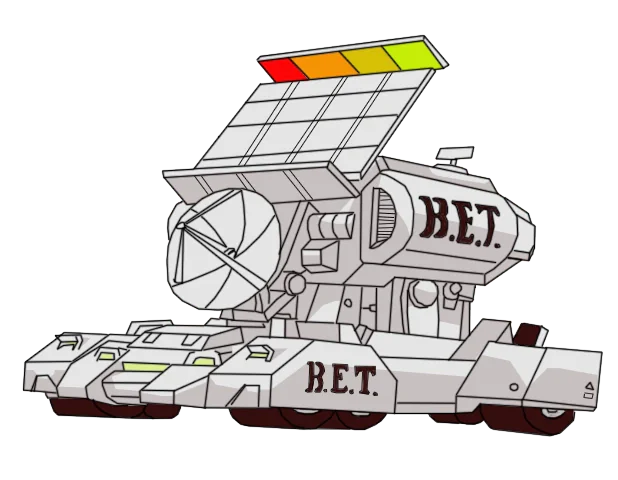

# Bluetooth Energy Transmitter for Home Assistant

<p align="center">
  
</p>

Named after the B.E.T. (Broadcast Energy Transmitter) from G.I. Joe.

Broadcast arbitrary BLE advertisements from your Home Assistant host's Bluetooth adapter. Use it to wake or toggle devices that react to a fixed advertisement, such as a remote's power button, without a device-specific integration for each one.

- **Saved signals as buttons.** Paste an advertisement copied from Home Assistant's Advertisement Monitor, or enter its fields, and it becomes a button entity such as `button.projector_power`.
- **A `bluetooth_energy_transmitter.send` action** for one-off or templated advertisements in scripts and automations.
- **Every advertisement field is exposed:** manufacturer data, service UUIDs, service data, solicit UUIDs, local name, appearance, type, TX power, discoverable flag, intervals and raw AD structures. Fields you leave empty aren't included in the packet.
- **No add-on needed on Home Assistant OS.** It talks to BlueZ directly over the host's system D-Bus, and it shares the adapter with Home Assistant's own Bluetooth integration.

> [!IMPORTANT]
> This only works for devices that act on a **fixed broadcast advertisement**. Devices that need a connection, pairing or encryption, rolling codes, or classic Bluetooth won't respond to a replayed packet.

## Requirements

- Home Assistant OS, or another Linux install where Home Assistant can reach BlueZ on the system D-Bus.
- A Bluetooth adapter that supports BLE advertising. BlueZ must expose `org.bluez.LEAdvertisingManager1` for it; most built-in and USB Bluetooth 4.0+ adapters do.

## Installation

### HACS

1. In HACS, open the menu (⋮) → **Custom repositories**.
2. Add `https://github.com/jmadelaine/ha-bluetooth-energy-transmitter` with type **Integration**.
3. Install **Bluetooth Energy Transmitter**, then restart Home Assistant.

### Manual

Copy `custom_components/bluetooth_energy_transmitter` into your Home Assistant `config/custom_components/` folder and restart.

## Setup

1. Go to **Settings → Devices & services → Add integration** and choose **Bluetooth Energy Transmitter**.
2. Pick a default adapter, or leave it on **Automatic** to use the first powered adapter with a free advertising slot.
3. On the Bluetooth Energy Transmitter integration page, select **Add signal** for each advertisement you want as a button. See [Adding a signal](#adding-a-signal).

To change a signal later, open its menu (⋮) on the integration page and select **Reconfigure**. To change the default adapter, select **Configure**.

## Adding a signal

This integration doesn't detect anything itself. You find the advertisement with Home Assistant's built-in Advertisement Monitor and give it to the integration, which stores it and replays it when you press the button.

### Paste from the Advertisement Monitor

1. Make sure the target device is in the state you want to trigger from (for example, the projector is off).
2. Open **Settings → Devices & services → Bluetooth → Configure → Advertisement Monitor**.
3. Press the button on the original remote, then select the remote's row in the monitor.
4. In the dialog, select **Copy to clipboard**.
5. On the Bluetooth Energy Transmitter integration page, select **Add signal → Paste from the Advertisement Monitor** and paste.
6. Check the pre-filled form, give the button a name, and submit.

The copied JSON includes `raw`, which is the remote's exact advertising packet. The import replays that packet field for field, including the appearance value, which only `raw` contains. The monitor also merges in the remote's scan response, a separate packet. Of that, the import keeps only the name: other scan response fields, such as extra service UUIDs, could push the advertisement past the 31 bytes Bluetooth 4.x receivers accept.

You can also paste a raw packet on its own as hex.

### Enter fields manually

Select **Add signal → Enter fields manually** and copy the fields the device is likely to check from the monitor:

- **Manufacturer data**: the key is the company ID in decimal; the value is the payload. Enter the key as the manufacturer ID (`70`, or `0x0046` in hex). Enter the value as the payload, **without** the company ID, because BlueZ adds it itself.
- **Local name**, **service UUIDs**, **service data**, as shown.

Start with everything the remote sends. If that works, you can try removing fields.

### Example: XGIMI Horizon 20 power

With the projector off, press the power button on its remote, then copy and paste its advertisement as above. The remote is named `XGIMI RC` in the monitor. The import produces:

| Field | Value |
| --- | --- |
| Manufacturer ID | `0x0046` (70) |
| Manufacturer data | the remote's 16-byte token |
| Local name | `XGIMI RC` |
| Service UUIDs | `00001812-0000-1000-8000-00805f9b34fb` (HID) |
| Appearance | `961` |
| Advertisement type | Peripheral |
| Duration | 4 s |

This matches the advertisement the [XGIMI integration](https://github.com/manymuch/Xgimi-4-Home-Assistant) uses to wake the projector from standby. That integration sends the local name `Bluetooth 4.0 RC`; if the projector doesn't react, try that name instead.

## The `bluetooth_energy_transmitter.send` action

```yaml
action: bluetooth_energy_transmitter.send
data:
  manufacturer_id: "0x0046"
  payload: "0a1b2c3d"          # your token
  local_name: "Bluetooth 4.0 RC"
  service_uuids: ["1812"]
  appearance: 961
  advertisement_type: peripheral
  duration: 4
```

The action returns once BlueZ has accepted the advertisement. Broadcasting continues in the background for `duration` seconds, so automations aren't held up. If BlueZ rejects the advertisement, or no adapter is available, the action fails with an error that says why.

If an identical advertisement is already on air on the same adapter, a new request joins it instead of using another advertising slot. Pressing a button repeatedly doesn't use up the adapter's limited slots.

| Field | Description |
| --- | --- |
| `manufacturer_id` | Company ID, 0–65535. Decimal (`70`) or `0x`-prefixed hex (`0x0046`). Ambiguous forms such as `0046` are rejected. Requires `payload`. |
| `payload` | Manufacturer data bytes as hex, without the company ID. Spaces, colons and `0x` prefixes are allowed. Requires `manufacturer_id`. |
| `local_name` | Advertised device name. |
| `service_uuids` | List of 16-bit (`"1812"`) or 128-bit UUIDs. |
| `appearance` | GAP appearance value, e.g. `961` for a keyboard. |
| `advertisement_type` | `peripheral` (connectable, default) or `broadcast` (non-connectable). |
| `duration` | Seconds to advertise, 1–10. Default 4. |
| `adapter` | `hci0`, a MAC address or a BlueZ path. Defaults to the integration's adapter. |
| `service_data` | Mapping of service UUID to hex, e.g. `{"fe95": "3020bc03"}`. |
| `solicit_uuids` | List of service UUIDs to solicit. |
| `include_tx_power` | Add a TX power level field to the packet. |
| `tx_power` | Transmit power to request from the controller, −127 to 20 dBm.¹ |
| `discoverable` | Set the LE General Discoverable flag. |
| `min_interval`, `max_interval` | Advertising interval in ms, 20–10240.¹ |
| `data` | Mapping of AD type (0–255) to hex for raw AD structures.¹ |

¹ Current BlueZ supports these directly. Older releases only honor them, and `tx_power`, when `bluetoothd` runs with `--experimental`, and otherwise ignore them without an error.

In the signal form, service data and raw AD structures are entered one per line as `uuid=hex` and `type=hex`.

## Adapter slots

Controllers support a limited number of simultaneous advertisements. BlueZ reports this as `SupportedInstances`; you can find it in the integration's diagnostics. Each signal that is broadcasting uses one slot for its duration. If all slots are in use, the action fails with "no free advertising slot". Home Assistant's own Bluetooth integration only scans, so it doesn't use advertising slots.

## Debug logging

On the integration page, select **Enable debug logging**. The log then shows:

- every adapter found, with its advertising capabilities (supported and active instances, supported includes, secondary channels, features, maximum advertising length and TX power range);
- the selected adapter and the advertisement being sent;
- registration and unregistration of each advertisement;
- D-Bus error names and messages from BlueZ.

**Download diagnostics** on the integration page gives a snapshot of the adapters and saved signals. Payloads are redacted.

## Troubleshooting

| Problem | What to check |
| --- | --- |
| Setup keeps retrying | Home Assistant can't reach BlueZ, or no adapter supports advertising. Enable debug logging and reload. |
| "Bluetooth adapter … is powered off" | Check the adapter under **Settings → Devices & services → Bluetooth**. |
| "The advertisement is too long" | Remove fields or shorten the payload. |
| Log warns about extended advertising | The advertising data is over 31 bytes, so BlueZ switched to Bluetooth 5 extended advertising. Bluetooth 4.x receivers can't see it. Remove fields until it fits. |
| The device doesn't react | Compare with the remote in the Advertisement Monitor: manufacturer ID, payload, name, UUIDs and appearance must match. Try a longer duration. The device may also need a connection or a rolling code, in which case replay won't work. |

## Thanks

Thanks to [Xgimi-4-Home-Assistant](https://github.com/manymuch/Xgimi-4-Home-Assistant) by Jiaxin. Its local BlueZ wake backend showed that a Home Assistant integration could advertise straight through BlueZ on Home Assistant OS, and this integration's BlueZ code is adapted from it. It's used under the MIT License; see [THIRD_PARTY_NOTICES.md](THIRD_PARTY_NOTICES.md).

## License

MIT. See [LICENSE](LICENSE).

## Development

```sh
python -m venv .venv
.venv/bin/pip install -r requirements_test.txt
.venv/bin/pytest
```

The tests replace the system bus with a fake BlueZ. Advertisement properties still go through dbus-fast's real `GetAll` handling and wire marshalling.
